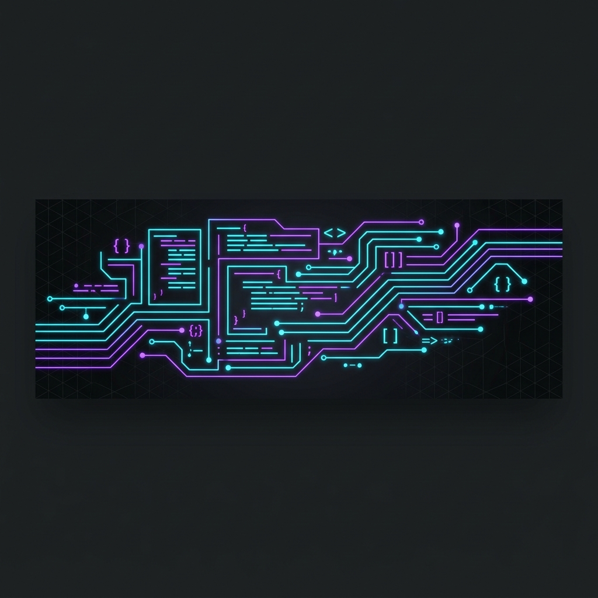

# Hi 👋, I'm Thắng (choc-developer)

  

<h3 align="center">Full-Stack Developer | Java Spring Boot & Node.js (NestJS)</h3>

  

  
  

---

## 📖 Giới thiệu bản thân (About Me)
Chào bạn! Tôi là một **Full-Stack Developer** tập trung vào phát triển ứng dụng web mạnh mẽ, bảo mật ở phía Backend và mượt mà, trực quan ở phía Frontend. Tôi đam mê thiết kế kiến trúc hệ thống sạch (Clean Architecture), xây dựng các hệ thống microservices và tối ưu hóa hiệu năng cơ sở dữ liệu.

- 🔭 Tôi hiện đang xây dựng các dự án Web Application & Mobile Application sử dụng **Spring Boot, NestJS, React & Flutter**.
- 🌱 Tôi đang tìm hiểu sâu thêm về cấu trúc hệ thống phân tán (Distributed Systems) và triển khai CI/CD trên Docker/AWS.
- 💬 Trao đổi với tôi về: **Spring Framework, NestJS, Hibernate/Prisma, React, Flutter, RESTful API, System Design**.
- 📫 Kết nối với tôi: **nt9901116@gmail.com**

---

## 🛠️ Bộ kỹ năng & Công nghệ (Tech Stack)

  <!-- Languages -->
  
  
  
  
  
  
  <!-- Backend & Databases -->
   
  
  
  
  
  
  
  
  
  <!-- Frontend & Tools -->
   
  
  
  
  
  
  

---

## 🏆 Dự án nổi bật (Featured Projects)

| Tên Dự Án | Mô Tả & Tính Năng Nổi Bật | Tech Stack | Link |
| --- | --- | --- | --- |
| **VietPixel (Game Store & Launcher)** | Nền tảng phân phối game PC/Web. Tích hợp Launcher quản lý cài đặt, DRM mã hóa game chống dịch ngược/copy, và module xử lý tranh chấp bản quyền (auto-ban, thu hồi doanh thu/ví Publisher). | Java Spring Boot, React, C# .NET, SQL | [Xem Code](https://github.com/thang-nt25/choc-developer) |
| **SCANMS (Affiliate Sales System)** | Hệ thống quản lý mạng lưới cộng tác viên bán hàng cho chuỗi cung ứng (Dự án tốt nghiệp). Quản lý phân quyền thành viên, cơ cấu tổ chức và tracking doanh số. | NestJS, React, PostgreSQL, Prisma, Docker | [Xem Code](https://github.com/thang-nt25/project-capstone-fall26) |
| **Central Kitchen SCM** | Hệ thống quản lý chuỗi cung ứng bếp trung tâm đến cửa hàng franchise. Quản lý công thức, sản xuất, lô hàng (lot-tracking), cảnh báo hạn sử dụng/tồn kho thấp và dashboard phân tích. | Node.js, Express, MongoDB, Socket.io, Swagger | [Xem Code](https://github.com/thang-nt25) |
| **MealYummy (Food Delivery)** | Nền tảng gọi món và quản lý bữa ăn trực tuyến cho khách hàng. Hệ thống hỗ trợ đặt hàng, tìm kiếm món ăn, quản lý thực đơn và Docker hóa dịch vụ. | React, Node.js, Express, MongoDB, Docker | [Xem Code](https://github.com/Nonoru/mealyummy-client) |
| **SportZone (Sports E-Commerce)** | Cửa hàng thương mại điện tử đồ thể thao với app di động. Quản lý sản phẩm/biến thể, giỏ hàng, thanh toán, thông báo, và chat hỗ trợ tự động. | NestJS, Flutter, MySQL, REST API | [Xem Code](https://github.com/thang-nt25) |
| **Unity Chess Game** | Game cờ vua 2D/3D phát triển bằng Unity engine, hỗ trợ chơi với máy (AI) hoặc chơi 2 người local, giao diện 3D mượt mà. | Unity, C# | [Xem Code](https://github.com/GameUnity-2025/UnityChess) |
| **Online Learning Platform** | Hệ thống quản lý học tập trực tuyến, cung cấp API xác thực phân quyền và quản lý tài liệu học tập. | Java Spring Boot, MySQL, REST API | [Xem Code](https://github.com/thang-nt25) |

---

## 📊 Thống kê GitHub (GitHub Stats)

  
  

  

 

  

